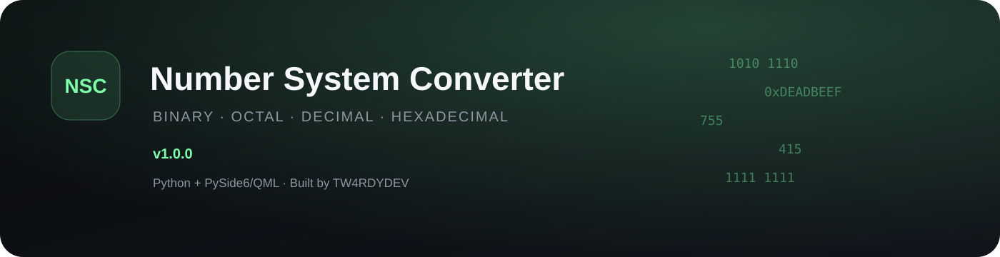
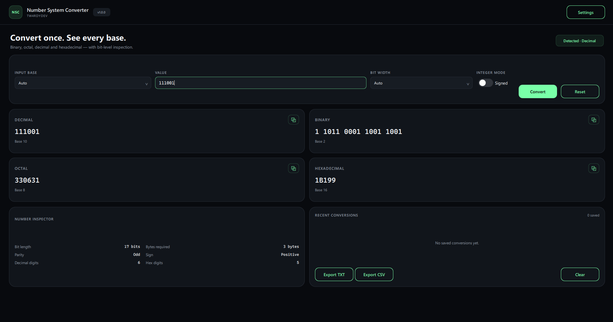

<div align="center">



<br>


[](https://github.com/TW4RDYDEV/number-system-converter/releases/latest)

**Binary · Octal · Decimal · Hexadecimal**

A polished desktop utility for developers, students, networking labs, and anyone who works with integer representations.

</div>

---

## Overview

**Number System Converter** converts integers between binary, octal, decimal, and hexadecimal while exposing the bit-level information behind the value.

Version `1.0.0` is a complete rebuild of the original Tkinter project using **Python, PySide6, and QML**. The application now provides live multi-base conversion, fixed-width integer modes, signed/unsigned interpretation, local history, export tools, and a redesigned desktop interface.

## Features

- Binary, octal, decimal, and hexadecimal conversion
- Automatic base detection for `0b`, `0o`, and `0x` prefixes
- Live conversion while typing
- All four number-system representations displayed simultaneously
- 8-bit, 16-bit, 32-bit, 64-bit, and Auto width modes
- Signed and unsigned integer interpretation
- Two's-complement interpretation for fixed-width bit patterns
- Negative decimal support in Signed mode
- Binary digit grouping
- Uppercase/lowercase hexadecimal preference
- Number inspector:
  - bit length
  - bytes required
  - parity
  - sign
  - decimal digit count
  - hexadecimal digit count
- Persistent conversion history
- Export history as TXT or CSV
- Dark, light, and system appearance modes
- Copy-to-clipboard actions
- Keyboard shortcuts
- Automated tests for the conversion engine
- Automated Windows build workflow for tagged releases

## Preview

```md

```

## Supported Input

| System | Base | Examples |
|---|---:|---|
| Binary | 2 | `101010`, `0b101010`, `1111 0000` |
| Octal | 8 | `755`, `0o755` |
| Decimal | 10 | `415`, `-42` |
| Hexadecimal | 16 | `F3C`, `0xDEADBEEF`, `ff` |

Spaces and underscores may be used as visual separators.

## Auto Detection

Auto mode intentionally avoids aggressive guessing.

- `0b...` → Binary
- `0o...` → Octal
- `0x...` → Hexadecimal
- Values containing `A-F` → Hexadecimal
- Digits-only values → Decimal

This prevents ambiguous values such as `10`, `100`, or `1010` from being silently treated as binary.

## Signed Mode

`Signed` controls whether a value may be interpreted as a signed integer.

With a fixed width (`8/16/32/64-bit`), binary/octal/hex inputs use two's-complement interpretation. In `Auto` width, signed non-decimal inputs automatically use the smallest whole-byte width. For example:

```text
1111 1111 + Signed + Auto  → -1 (8-bit)
1111 1111 + Unsigned       → 255
0x80 + Signed + Auto       → -128 (8-bit)
```

This keeps Auto mode useful while avoiding ambiguity for decimal input.

## Fixed-Width Integer Modes

Choose `8-bit`, `16-bit`, `32-bit`, or `64-bit` to inspect the value as an integer with a specific width.

Example:

```text
Input: FF
Input base: Hexadecimal
Width: 8-bit
Mode: Signed

Decimal:      -1
Binary:       1111 1111
Octal:        377
Hexadecimal:  FF

Unsigned interpretation: 255
Signed interpretation:   -1
```

## Keyboard Shortcuts

| Shortcut | Action |
|---|---|
| `Ctrl + L` | Focus the input field |
| `Ctrl + R` | Reset converter |
| `Ctrl + C` | Copy decimal result |
| `Esc` | Clear/reset input |
| `Enter` | Convert and add to history |

## Download

The recommended way to use Number System Converter is the official standalone Windows release.

### Windows

1. Open the **[Latest Release](https://github.com/TW4RDYDEV/number-system-converter/releases/latest)**.
2. Download:

```text
NumberSystemConverter-v1.0.0-Windows-x64.exe
```

3. Run the executable.

No Python installation or dependency setup is required.

A SHA-256 checksum is published with the release so the downloaded executable can be verified.

### Run from source

Developers who prefer to run the source code can clone the repository:

```bash
git clone https://github.com/TW4RDYDEV/number-system-converter.git
cd number-system-converter
```

Create and activate a virtual environment, then install the runtime dependency:

```bash
python -m venv .venv
pip install -r requirements.txt
python main.py
```

## Development

Install development dependencies:

```bash
pip install -r requirements.txt -r requirements-dev.txt
```

Run tests:

```bash
pytest -q
```

## Project Structure

```text
number-system-converter/
├── main.py
├── requirements.txt
├── requirements-dev.txt
├── pyproject.toml
│
├── app/
│   ├── backend.py
│   ├── core/
│   │   ├── converter.py
│   │   ├── detector.py
│   │   └── formatter.py
│   ├── services/
│   │   ├── history.py
│   │   └── settings.py
│   └── ui/
│       ├── Main.qml
│       ├── components/
│       │   ├── AppButton.qml
│       │   ├── ResultCard.qml
│       │   ├── StyledComboBox.qml
│       │   ├── StyledTextField.qml
│       │   └── ToggleSwitch.qml
│       └── pages/
│           ├── ConverterPage.qml
│           └── SettingsPage.qml
│
├── tests/
│   ├── test_converter.py
│   ├── test_detector.py
│   └── test_formatter.py
│
├── assets/
│   ├── banner.svg
│   ├── icon.ico
│   └── icon.png
│
├── .github/
│   └── workflows/
│       └── build-release.yml
│
├── CHANGELOG.md
├── LICENSE
└── README.md
```

## Release Automation

Windows executables are built automatically by **GitHub Actions** on a Windows runner.

When a version tag such as `v1.0.0` is pushed, the workflow:

1. installs the project dependencies,
2. runs the complete test suite,
3. builds the standalone Windows executable,
4. generates a SHA-256 checksum,
5. creates the GitHub Release, and
6. attaches both files to the release.

Users therefore do **not** need to build the executable themselves.

## License

This project is **source-available**, not OSI open source.

Personal, educational, evaluation, and other non-commercial use is permitted under the included license.

**Commercial use, resale, monetization, or use in a commercial product/service requires prior written permission from TW4RDYDEV.**

Attribution and copyright notices may not be removed.

See [`LICENSE`](LICENSE) for the full terms.

## Author

**TW4RDYDEV**

Cybersecurity · Networking · Software Development

---

<div align="center">

Built with Python + PySide6/QML.

</div>
